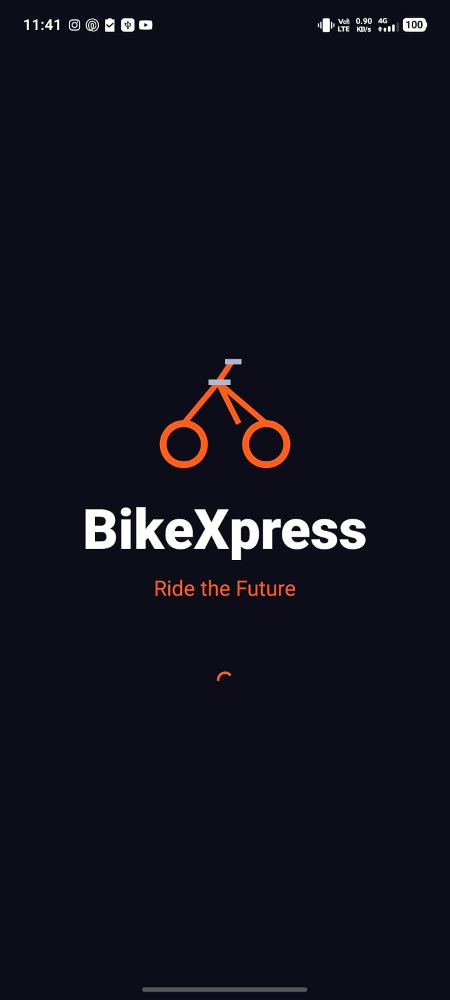
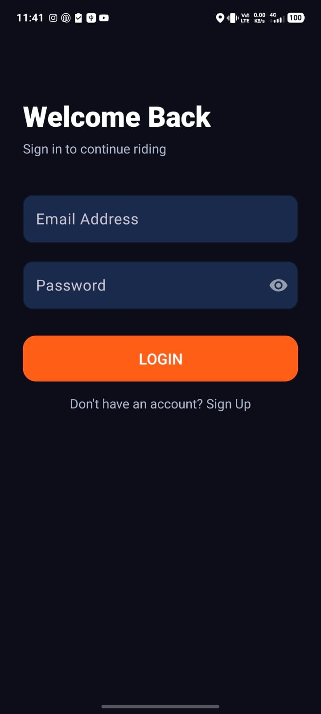
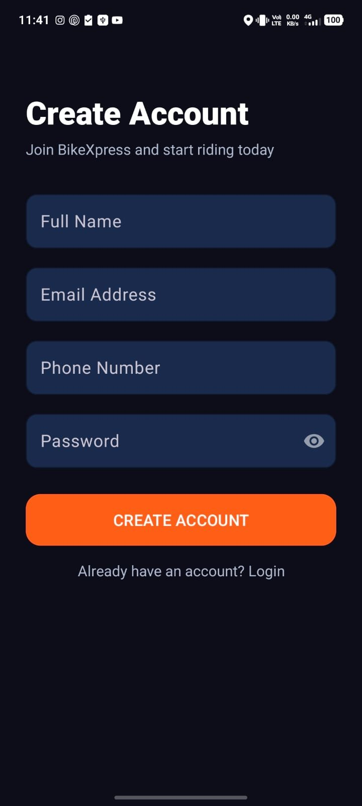
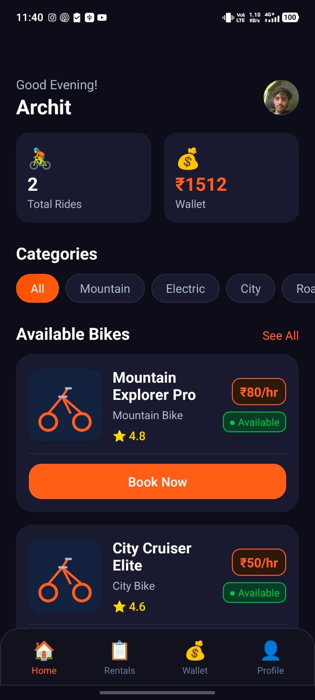
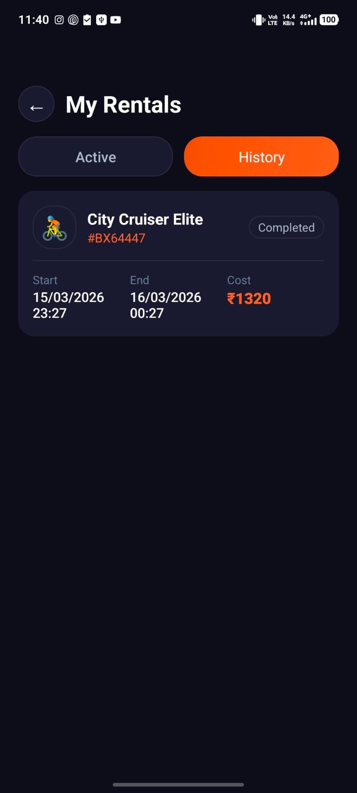
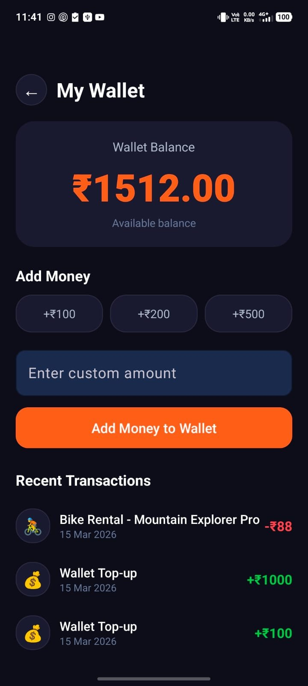
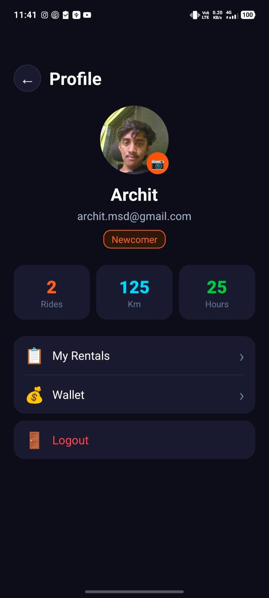

# 🚴 VoltRide — Ride Smarter

> A modern Android bike rental app built with Java & SQLite. Dark themed UI with smart booking, in-app wallet, ride tracking, rental history, and profile with camera support.

## ⬇️ Download App

[](https://github.com/arcrtic/BikeXpress/releases/download/v1.0/app-debug.apk)

> **Direct Download:** [Click here to download BikeXpress v1.0](https://github.com/arcrtic/BikeXpress/releases/download/v1.0/app-debug.apk)

> ⚠️ Requires Android 7.0 (API 24) or higher — Enable **"Install from Unknown Sources"** in Settings before installing

---

## 📸 Screenshots

| Splash | Login | Register |
|--------|-------|----------|
|  |  |  |

| Home | My Rentals (Active) | My Rentals (History) |
|------|---------------------|----------------------|
|  |  |  |

| Wallet | Profile |
|--------|---------|
|  |  |

---

## ✨ Features

- 🌙 **Dark Modern UI** — Deep navy + orange neon theme
- 🎬 **Animated Splash Screen** — with fade-in animations
- 📖 **3-Page Onboarding** — shown only on first launch
- 🔐 **Auth System** — Register & Login with SQLite
- 🏠 **Home Dashboard** — Greeting, wallet balance, ride stats
- 🏷️ **Category Filter** — All, Mountain, Electric, City, Road, BMX
- 🚴 **8 Sample Bikes** — with ratings, range, gears, weight info
- 📅 **Smart Booking** — DateTimePicker, duration chips, cost calculator
- 💰 **In-App Wallet** — Add money, transaction history, balance tracking
- 📋 **My Rentals** — Active and History tabs
- 🗺️ **Track Ride** — Live timer, distance simulation, location updates
- ✅ **Booking Confirmation** — Animated checkmark screen with booking ID
- 👤 **Profile** — Ride stats, rider badge, round profile picture
- 📷 **Camera/Gallery** — Update or remove profile picture
- 🔴 **Logout** — With confirmation dialog

---

## 🛠️ Tech Stack

| Technology | Usage |
|------------|-------|
| Java | Primary language |
| SQLite | Local database |
| RecyclerView | Bike list, rentals, transactions |
| ViewPager2 | Onboarding slides |
| Material Design 3 | UI components |
| FileProvider | Camera integration |
| SharedPreferences | Session management |
| Handler + Runnable | Live ride timer |

---

## 📋 Requirements

- Android Studio **Hedgehog 2023.1.1** or newer
- Android SDK **API 24** (Android 7.0) minimum
- Android SDK **API 34** (Android 14) target
- Java **11**
- Gradle **8.4**
- AGP **8.2.2**
- Internet connection (for first Gradle sync only)

---

## 🚀 How to Run — Step by Step

### Step 1 — Install Android Studio

Download and install Android Studio from:
👉 https://developer.android.com/studio

During setup, make sure to install:
- Android SDK
- Android Virtual Device (AVD)

---

### Step 2 — Clone or Download the Project

**Option A — Clone with Git:**
```bash
git clone https://github.com/arcrtic/BikeXpress.git
```

**Option B — Download ZIP:**
1. Go to the GitHub repository
2. Click the green **`Code`** button
3. Click **`Download ZIP`**
4. Extract the ZIP to a folder like `D:\BikeXpress`

> ⚠️ **Important:** Do NOT extract to OneDrive or any cloud-synced folder. Use a local path like `D:\Projects\BikeXpress` to avoid Gradle build errors.

---

### Step 3 — Open in Android Studio

1. Open Android Studio
2. Click **`Open`** (or `File → Open`)
3. Navigate to the extracted `BikeXpress` folder
4. Click **`OK`**
5. Wait for Android Studio to index the project

---

### Step 4 — Sync Gradle

Android Studio will automatically start syncing Gradle. If it doesn't:

1. Click **`File`** in the top menu
2. Click **`Sync Project with Gradle Files`**
3. Wait for the sync to complete (requires internet for first run)

You will see **"Gradle sync finished"** at the bottom when done.

---

### Step 5 — Set Up an Emulator or Real Device

**Option A — Emulator:**
1. Click **`Tools → Device Manager`**
2. Click **`Create Device`**
3. Select **Pixel 6** → Click Next
4. Select **API 34 (Android 14)** → Download if needed → Click Next
5. Click **Finish**

**Option B — Real Android Phone:**
1. On your phone go to **Settings → About Phone**
2. Tap **Build Number** 7 times to enable Developer Options
3. Go to **Settings → Developer Options**
4. Enable **USB Debugging**
5. Connect phone to PC via USB
6. Allow USB debugging when prompted on your phone

---

### Step 6 — Build and Run

1. Select your emulator or device from the dropdown at the top
2. Click the **green play button ▶** (or press `Shift + F10`)
3. Wait for the app to build and install
4. The app will launch automatically on your device

---

### Step 7 — First Time Using the App

1. The **Splash Screen** appears with animation
2. **Onboarding** shows 3 slides (only on first launch)
3. Tap **Get Started** → goes to **Register** screen
4. Fill in Name, Email, Phone, Password → tap **CREATE ACCOUNT**
5. You get **₹500 welcome bonus** in wallet automatically
6. You are taken to the **Home Screen**

---

## 📁 Project Structure

```
BikeXpress/
├── app/
│   ├── src/
│   │   └── main/
│   │       ├── java/com/example/bikexpress/
│   │       │   ├── DatabaseHelper.java        # SQLite database
│   │       │   ├── BikeModel.java             # Bike data model
│   │       │   ├── BikeAdapter.java           # RecyclerView adapter
│   │       │   ├── RentalAdapter.java         # Rentals list adapter
│   │       │   ├── TransactionAdapter.java    # Wallet transactions adapter
│   │       │   ├── SplashActivity.java        # Splash screen
│   │       │   ├── OnboardingActivity.java    # 3-page onboarding
│   │       │   ├── LoginActivity.java         # Login screen
│   │       │   ├── RegisterActivity.java      # Register screen
│   │       │   ├── HomeActivity.java          # Main home screen
│   │       │   ├── BikeDetailActivity.java    # Bike details page
│   │       │   ├── BookingActivity.java       # Booking screen
│   │       │   ├── BookingConfirmActivity.java# Booking confirmation
│   │       │   ├── MyRentalsActivity.java     # Active + history rentals
│   │       │   ├── WalletActivity.java        # Wallet + transactions
│   │       │   ├── ProfileActivity.java       # Profile + camera
│   │       │   ├── TrackRideActivity.java     # Live ride tracker
│   │       │   └── BikeListActivity.java      # Bike list
│   │       ├── res/
│   │       │   ├── layout/                    # All XML layouts
│   │       │   ├── drawable/                  # Shapes, vectors, icons
│   │       │   ├── values/                    # Colors, themes, strings
│   │       │   └── xml/                       # FileProvider paths
│   │       └── AndroidManifest.xml
│   └── build.gradle.kts
├── gradle/
│   ├── libs.versions.toml                     # Dependency versions
│   └── wrapper/
│       └── gradle-wrapper.properties
├── build.gradle.kts
├── settings.gradle.kts
├── gradle.properties
└── README.md
```

---

## 🗄️ Database Schema

The app uses **SQLite** with 4 tables:

| Table | Columns |
|-------|---------|
| `users` | id, name, email, phone, password, wallet_balance, total_rides, total_km, total_hours |
| `bikes` | bike_id, bike_name, description, category, price_per_hour, rating, review_count, max_range, gears, weight, is_available |
| `rentals` | rental_id, user_id, bike_id, start_time, end_time, duration_hrs, total_cost, location, status, booking_ref |
| `transactions` | tx_id, user_id, title, amount, type, date |

---

## 🐛 Common Issues & Fixes

| Error | Fix |
|-------|-----|
| `R cannot be resolved` | `Build → Clean Project` then `Build → Rebuild Project` |
| `Gradle sync failed` | Check internet connection, then `File → Sync Project with Gradle Files` |
| `Access Denied on build folder` | Delete `app/build` folder manually, then rebuild |
| `resource mipmap not found` | Right-click `res → New → Image Asset` to regenerate launcher icons |
| App crashes on launch | Check `AndroidManifest.xml` package name matches `build.gradle.kts` namespace |
| Build error on OneDrive | Move project to a local folder like `D:\Projects\BikeXpress` |

---

## 🎨 Color Palette

| Color | Hex | Usage |
|-------|-----|-------|
| Primary Orange | `#FF6B35` | Buttons, accents, highlights |
| Dark Navy | `#0D0D1A` | Background |
| Card Dark | `#1A1A2E` | Cards, surfaces |
| Input Blue | `#1E2A4A` | Input fields |
| Success Green | `#00C853` | Available badge |
| Error Red | `#FF5252` | Errors, unavailable |
| Electric Blue | `#00D4FF` | Km stat highlight |

---

## 👨‍💻 Developer

**Archit** — Built as a MAD (Mobile Application Development) project

[](https://github.com/arcrtic)

---

## 📄 License

This project is open source and available under the [MIT License](LICENSE).

---

<div align="center">
  Made with ❤️ by Archit &nbsp;|&nbsp; BikeXpress 🚴
</div>
