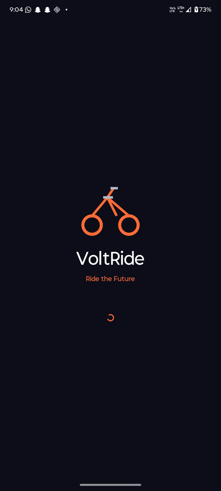
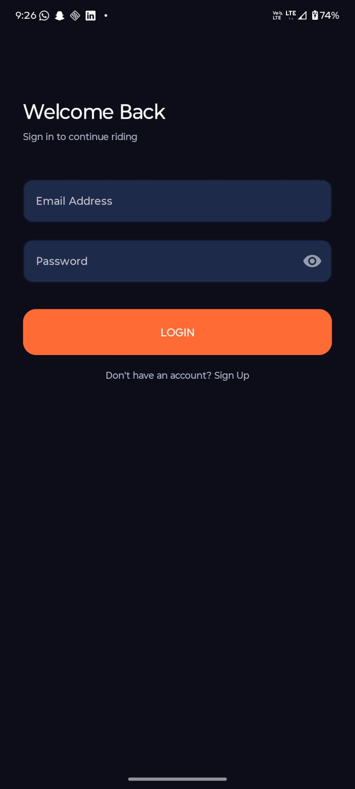
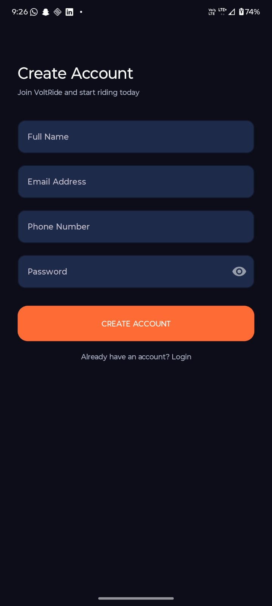
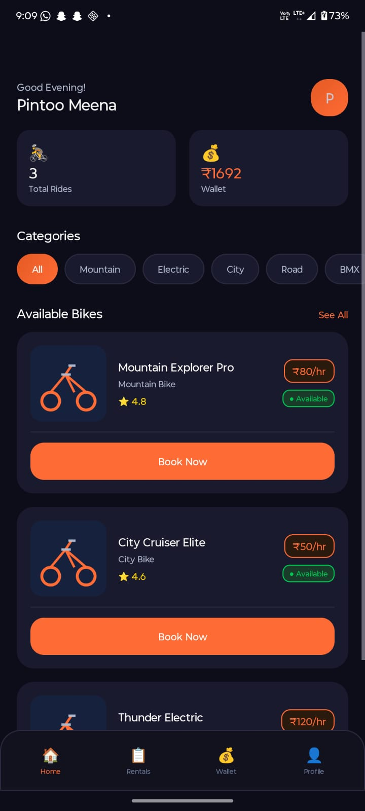
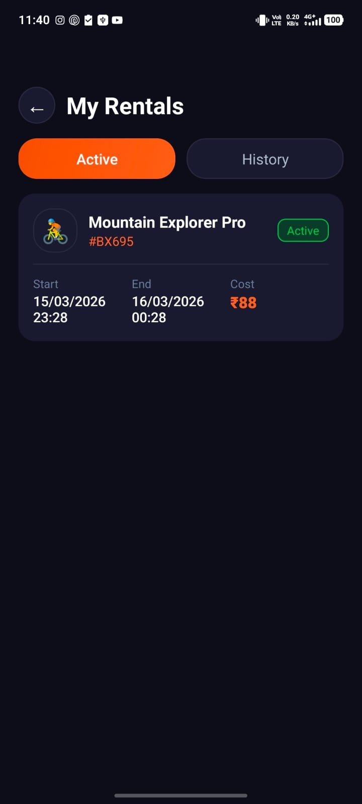
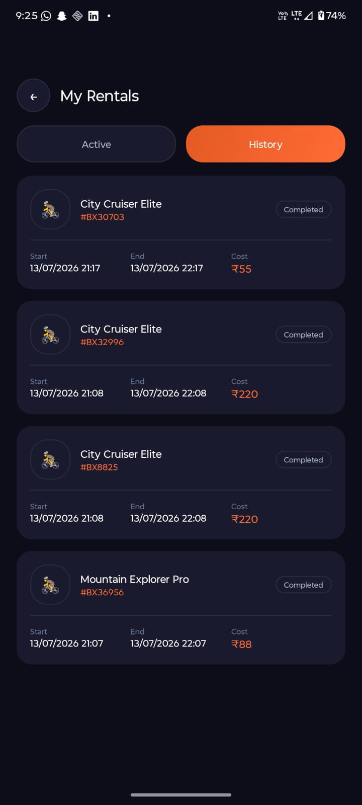
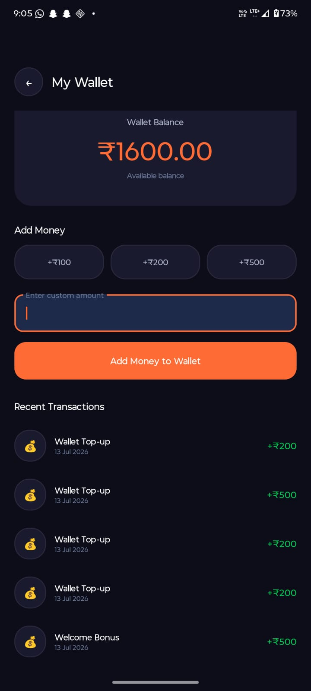
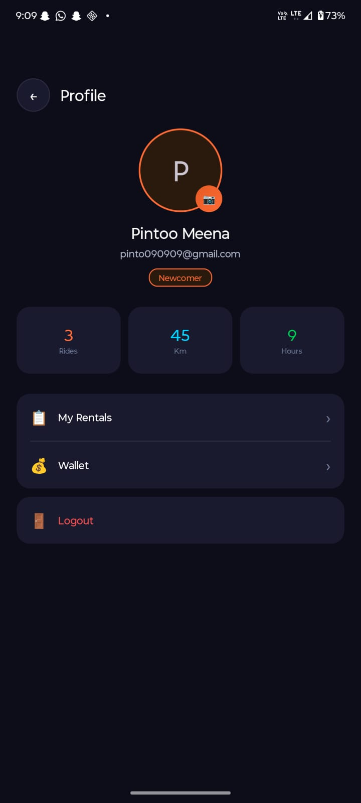

# 🚴 VoltRide - Android Bike Rental Application

A feature-rich Android bike rental application developed using Java, SQLite, and Material Design.

Users can browse bikes, book rides, manage rentals, track rides, and use an integrated digital wallet.
---

## 📸 Screenshots

| Splash | Login | Register |
|--------|-------|----------|
|  |  |  |

| Home | My Rentals (Active) | My Rentals (History) |
|------|---------------------|----------------------|
|  |  |  |

| Wallet | Profile |
|--------|---------|
|  |  |

---

## ✨ Key Features

- 🌑 Clean and responsive dark-themed user interface
- 🚀 Smooth splash screen with startup animation
- 📱 Introductory onboarding screens for new users
- 🔑 Secure user registration and login using SQLite
- 🏠 Dashboard displaying available bikes and user statistics
- 🚲 Browse bikes across multiple categories
- ⭐ Bike listings with price, rating, range, gears, and availability
- 📅 Reserve bikes by selecting date, time, and rental duration
- 💳 Digital wallet with balance management and transaction history
- 📂 View active bookings and completed rental history
- 📍 Ride tracking with timer and distance updates
- ✔️ Booking confirmation with unique booking reference
- 👤 User profile with ride statistics and profile management
- 📸 Upload or change profile picture using camera or gallery
- 🚪 Secure logout with confirmation prompt

---

## 🛠️ Tech Stack

| Technology | Usage |
|------------|-------|
| Java | Primary language |
| SQLite | Local database |
| RecyclerView | Bike list, rentals, transactions |
| ViewPager2 | Onboarding slides |
| Material Design 3 | UI components |
| FileProvider | Camera integration |
| SharedPreferences | Session management |
| Handler + Runnable | Live ride timer |

---

## 📁 Project Structure

```
VoltRide/
├── app/
│   ├── src/
│   │   └── main/
│   │       ├── java/com/example/bikexpress/
│   │       │   ├── DatabaseHelper.java        # SQLite database
│   │       │   ├── BikeModel.java             # Bike data model
│   │       │   ├── BikeAdapter.java           # RecyclerView adapter
│   │       │   ├── RentalAdapter.java         # Rentals list adapter
│   │       │   ├── TransactionAdapter.java    # Wallet transactions adapter
│   │       │   ├── SplashActivity.java        # Splash screen
│   │       │   ├── OnboardingActivity.java    # 3-page onboarding
│   │       │   ├── LoginActivity.java         # Login screen
│   │       │   ├── RegisterActivity.java      # Register screen
│   │       │   ├── HomeActivity.java          # Main home screen
│   │       │   ├── BikeDetailActivity.java    # Bike details page
│   │       │   ├── BookingActivity.java       # Booking screen
│   │       │   ├── BookingConfirmActivity.java# Booking confirmation
│   │       │   ├── MyRentalsActivity.java     # Active + history rentals
│   │       │   ├── WalletActivity.java        # Wallet + transactions
│   │       │   ├── ProfileActivity.java       # Profile + camera
│   │       │   ├── TrackRideActivity.java     # Live ride tracker
│   │       │   └── BikeListActivity.java      # Bike list
│   │       ├── res/
│   │       │   ├── layout/                    # All XML layouts
│   │       │   ├── drawable/                  # Shapes, vectors, icons
│   │       │   ├── values/                    # Colors, themes, strings
│   │       │   └── xml/                       # FileProvider paths
│   │       └── AndroidManifest.xml
│   └── build.gradle.kts
├── gradle/
│   ├── libs.versions.toml                     # Dependency versions
│   └── wrapper/
│       └── gradle-wrapper.properties
├── build.gradle.kts
├── settings.gradle.kts
├── gradle.properties
└── README.md
```

---

## 🗄️ Database Schema

The app uses **SQLite** with 4 tables:

| Table | Columns |
|-------|---------|
| `users` | id, name, email, phone, password, wallet_balance, total_rides, total_km, total_hours |
| `bikes` | bike_id, bike_name, description, category, price_per_hour, rating, review_count, max_range, gears, weight, is_available |
| `rentals` | rental_id, user_id, bike_id, start_time, end_time, duration_hrs, total_cost, location, status, booking_ref |
| `transactions` | tx_id, user_id, title, amount, type, date |

---
